# devoxx-2022
Devoxx 2022 notes

> Jeudi 21/04/2022

## Micro Frontends REX - Diviser pour mieux régner !
> Hugo CHIAVENUTO

Note: 5/5  
Commentaire: Super talk, REX intéressant, sujet à creuser  

[Lien devoxx](https://cfp.devoxx.fr/2022/talk/YCJ-0118/Micro_Frontends_REX_-_Diviser_pour_mieux_regner_!)

équipe: 3 apps, 15 devs  
Manfred Steyer (dev angular)

### Lombard Odier Group
Bank à Genève  
Bank As A Service  
Pas mal de legacy, client lourd monolithique  

### Concept
Approche Composant vs MFE  
Approche horizontale -> SSR  
Approche Verticale  
Webpack 5 fédération de module + lazy loading  

### Pratique
POC sur 1 vue à découper en micro frontend  
Layout embarque des widgets  
Les widgets sont autonomes (interaction serveur, ...)  
Communication inter-widget par bus de communication (events)  

### Challenges & pitfalls
Global state: utilisation de store + observables  
Cache Http: au niveau du service http de haut niveau (éviter que 10 widget fasse 10 req)  
Widget State: identifier les widgets?  
Gestion des modules angular: galère pour l'instant  
-> solution pe dans angular 14.1 (no modules)  

----

## Model-Driven Design
> Bruno BOUCARD

Note: 2/5  
Commentaire: Des concepts mais ça manque de concret  

[Lien devoxx](https://cfp.devoxx.fr/2022/talk/UDV-2868/Model-Driven_Design)

Problème d'interdépendance sur le schéma DB  
42zkillz?  
wirfs-brook.com  

### Cas d'école
Réservation de place de théâtre  
étude  
-> event storming (atelier)  
-> example mapping  
-> MDD  

### Livecoding
Utilisation des ValueObject entre les couches de Controller et Service  

### Aller plus loin
-> deep model  
analysis pattern  
TDD Outside/In  

### Take away

Blue book Domain-Driven Design

-----

## What's cooking in maven
> Maven 4 what's new ? par Maarten Mulders (Commiter on maven project)

Note: 4/5
Commentaire: Des fonctionnalités intéressantes qui vont arriver, bien d'avoir des rappels sur maven

[Lien devoxx](https://cfp.devoxx.fr/2022/talk/MPH-2660/What's_cooking_in_Maven%3F)

### Maven wrapper
Supported by apache officialy now  
apache-wrapper.sh  

### Build/Consumer POM
pom in vcs != pom in repo  
will allow to change pom structure without breaking mvn version  

### Improved reacto
In a multi module scenario (100+ modules)  
Improved the reactor so that it can scan folders for modules without resolving  
Use empty file .mvn to indicate that the dir is the at top level of the app  
Resume failing build more easily  
Compile project in different directory with -f option  

### Dessert: Maven deamon
Goal: make the build faster (it does ! it looks very very quick)  
cool option to debug long build time: -Dmvnd.buildTime=true  
Keeps things warm (memory, JVM, modules, plugins, ...)  
Multi-thread the build by default  
Probably wont support the wrapper  

### Take away

Release date unknown

----

## Lens
> k8s graphical interface open source (talk by Mirantis)

Note: 4/5  
Commentaire: Je découvre cet outil aprés avoir galérer 1an avec kube en console, à installer dès lundi

[Lien devoxx](https://cfp.devoxx.fr/2022/talk/RAX-2612/Eliminez_la_complexite_de_Kubernetes_avec_LENS_!)

Kubernetes IDE number 1  
-> bon outil pour démarrer avec kube  
-> goto solution for Carrefour  

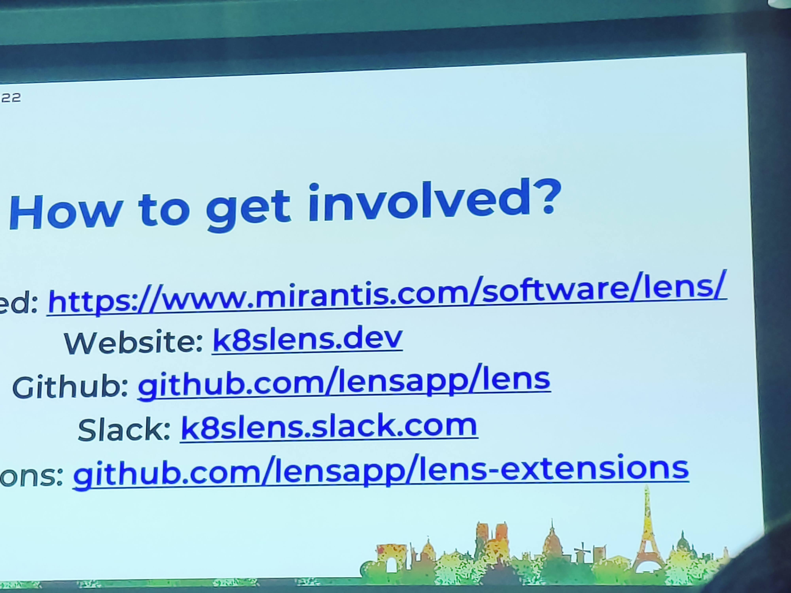

https://www.mirantis.com/software/lens/  
https://github.com/lensapp  
https://k8slens.dev/

----

## S'affranchir de la pyramide des tests
> Par Jonathan Boccara

Note: 1/5
Commentaire: Approche et message franchement perturbant  
Il faut bien sûr faire des UT, des IT et des tests E2E intelligemment

[Lien devoxx](https://cfp.devoxx.fr/2022/talk/CYM-1712/S'affranchir_de_la_Pyramide_des_Tests)

----

## The unknowns of JUnit 5
> by Mike KOWALSKI

Note: 5/5  
Commentaire: Super talk, dynamique ! J'avais oublié toutes ces supers features, ça donne des idées !  

[Lien devoxx](https://cfp.devoxx.fr/2022/talk/LKZ-8754/The_unknowns_of_JUnit_5)

### Data table tests
RTFM !  
Use @ParameterizedTest  
Use @CsvSource  
Nice aswell: @DyanmicTest, ...

### Wiremock
@ExtendWith (+BeforeAllClass, resolveParameter, ...) instead of inheritance  
-> go WiremockExtensions  

### Parallelize
@Execution (still experimental)  
use junit config files  

### Link to sources
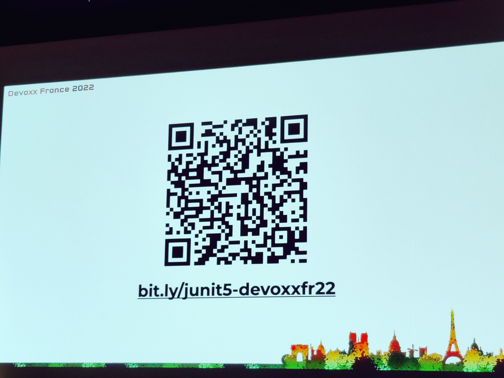

----

## Sujets transverses
Sujet pour la formation devops 1: gitpod  
Sonatype (aka nexus) OSS index (scan secu)  

----

> Vendredi 22/04/2022

## Spring MVC -> Spring Webflux
> Mathilde et Hugo

Note: 5/5  
Commentaire: On voit qu'ils sont solides sur le sujet et ils présentent clairement les pros and cons  

[Lien devoxx](https://cfp.devoxx.fr/2022/talk/RKZ-1909/Migrer_de_Spring_MVC_a_Spring_Web_Flux)

### Reactor
2015  

### Pros & cons
Jointures/ORM -> KO  
Transactions -> OK  
HttpRequest -> OK  
Cache -> ~ cache in cache  

### Conclusion
Spring webflux peut être utilisé dans certains cas (mais pas tous)  
Comparatif avec Node? à investiguer  
Limit de webflux vs threads virtuels à venir  

----

## Doctolib XXL Database
> Bertarnd Paquet & David Gageot

Note: 4/5  
Commentaire: Comparatif intéressant, même si l'architecture de Doctolib me fait trés peur  

[Lien devoxx](https://cfp.devoxx.fr/2022/talk/KCB-5237/Doctolib_a_besoin_d'une_base_de_donnees_plus_puissante._Ok,_mais_laquelle%3F)

### Scaling database
Actuel: 25 TB largest aws (aurora) db image  

### Spanner
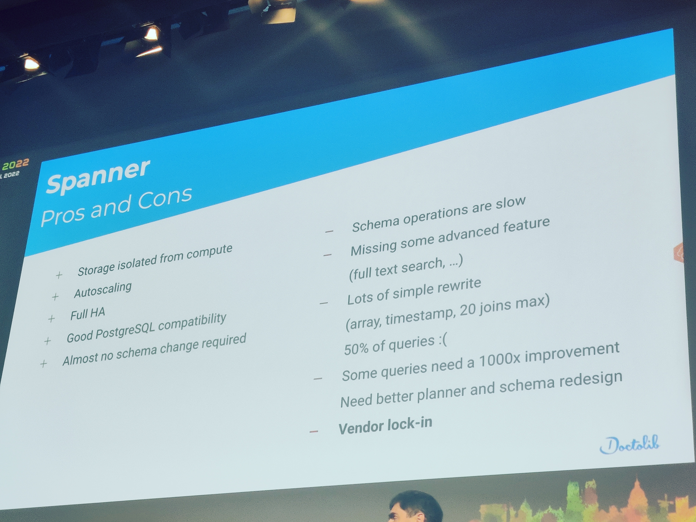

### Citus MX
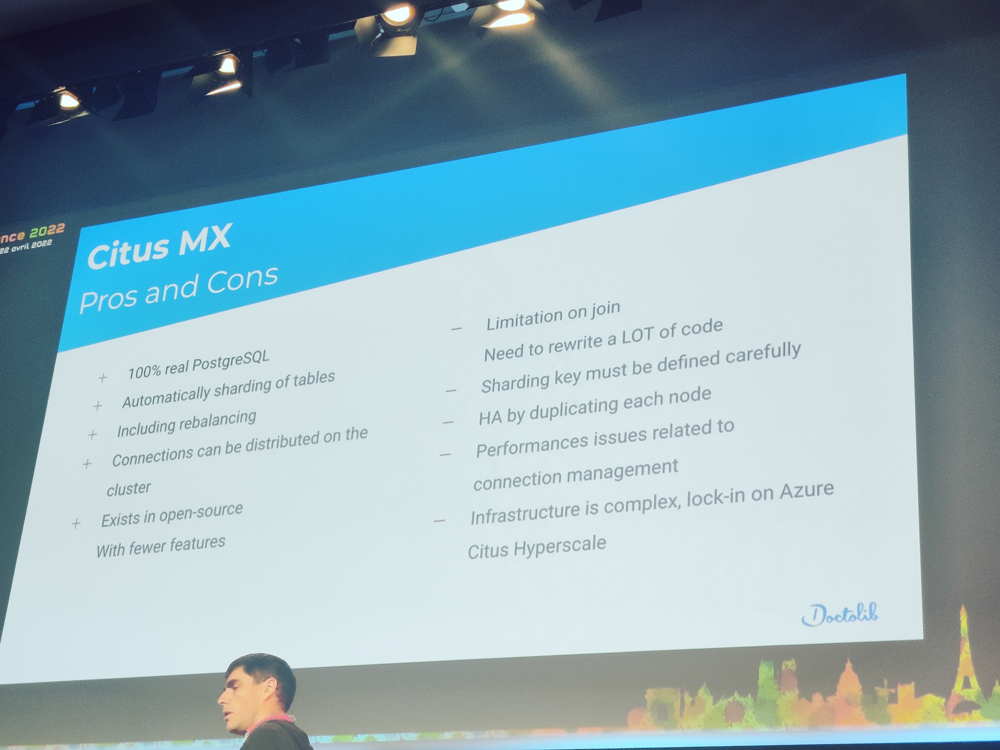

### Yugabyte

### Solution
(comment permettre au développeur d'utiliser ce type d'outillage pour bosser)  
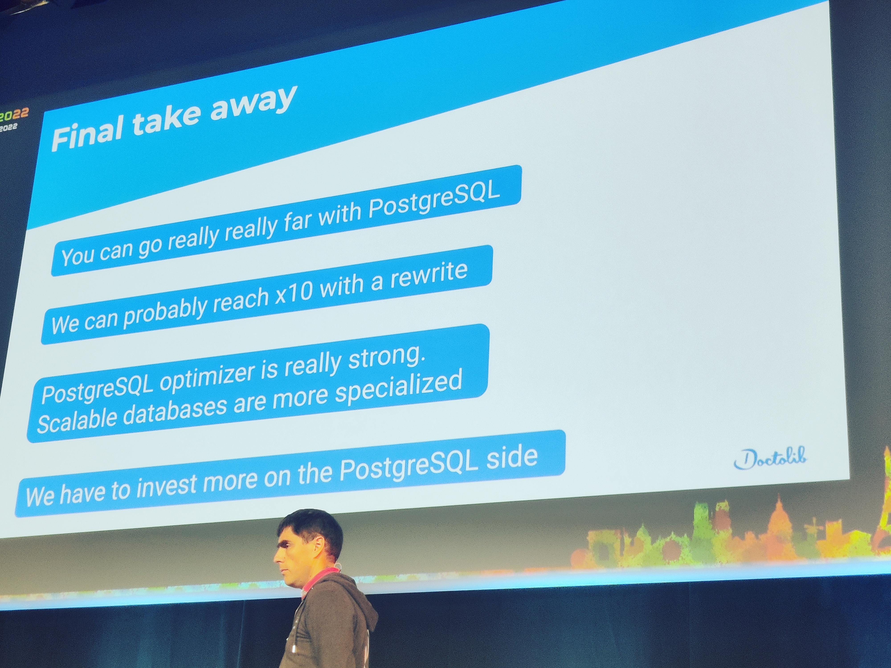
Foreign Data Wrappers -> bonne solution pour le scaling  

### Questions
Partition -> sujet complémentaire qui peut solutionné partiellement  
Anonymisation de la db: trigger sur les champs qui sont anonymisé par hash/overwrite  

----

## TLS / OpenSSL
> Mathieu Humbert (Accenture)

Note: 4/5  
Commentaire: Speaker très pro, sujet un soporifique mais important  

[Lien devoxx](https://cfp.devoxx.fr/2022/talk/NXR-6022/Mieux_maitriser_TLS,_OpenSSL_et_les_certificats)

### TLS
Confidentialité: chiffrage  
Authentification: certificate  
Intégrité: checksum (MAC)  

Protocol:  
TLS handswhake (cypher suites)  
puis data  

### Cypher suites
Cf détail du certificat  
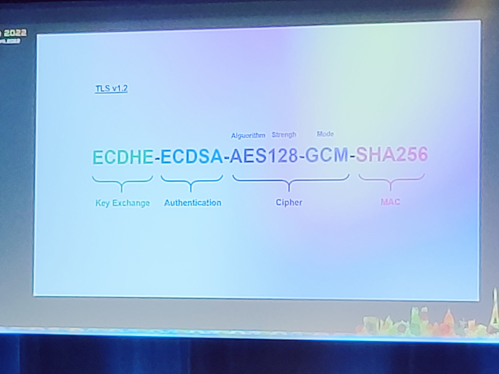
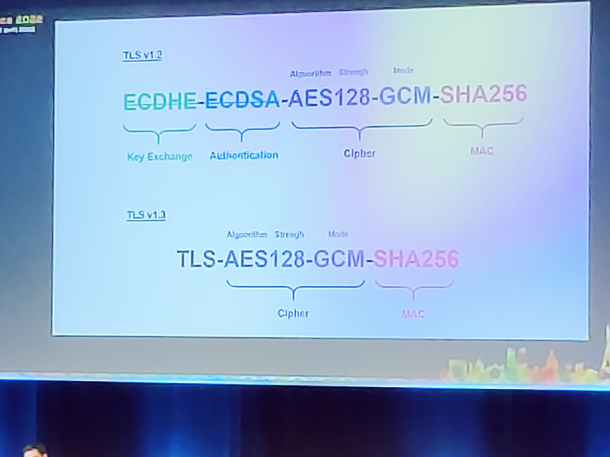
Diffie Hellman requis pour l'échange clef dans TLS 1.3  
Cet algo permet de sécuriser l'échange de clef  
AEAD: grâce à GCM (chiffrement et intégrité fait au même moment)  

Attention: en TLS 1.2 certain cypher suites ne sont pas forcément tous sécu  

### Certificat
format X509 avec clef publique + signature certifiée  
système basé sur la confiance (! mais il faut maîtriser les certificats root et intermédiaires)  

----

## Signature électronique
> Vincent Galloy & Arnaud Jeansen

Note: 4/5  
Commentaire: Talk qui va droit au but et intéressant si on a un intérêt pour la signature électronique 
(sinon passer son chemin)

[Lien devoxx](https://cfp.devoxx.fr/2022/talk/NQU-4965/La_signature_electronique_vue_par_des_developpeurs_Java.)

Développeurs chez Quicksign  
Cadre règlementaire européen (les règles sont différentes aux US, en Afrique, ...)  

### Signature
identification (qui a signé) + intégrité (le document n'a jamais été altéré)  
-> crypto required (sha256, ...)  
SSL et autorité de certification permettent  de s'assurer qu'aucun tiers ne veut altérer l'identification  
Standard internet: CMS  
Standard européen: CAdES (CMS Avanced ES)  
Plusieurs niveaux de signature électronique (baseline, temporal, long term, availability)  

### Signature en java
Lib édition pdf java utilisée chez QuickSign: Apache PdfBox (d'autres solutions existent)  
NB: PdfBox ne gère pas la signature mais fourni juste une interface pour le faire  
Lib pour sécuriser la signature en Java: BouncyCastle  

----

## Microservices et cohérence des données
> JF James @Worldline

Note: 4/5  
Commentaire: Cas concret, outils intéressants mais sujet très, très dense  

[Lien devoxx](https://cfp.devoxx.fr/2022/talk/JSV-6705/Architecture_microservices_et_coherence_des_donnees_:_mais_on_fait_comment_pour_de_vrai_%3F)

Comment distribuer des transactions sur différentes microservices (transaction, compensation, ...)?  
(et de manière performante)

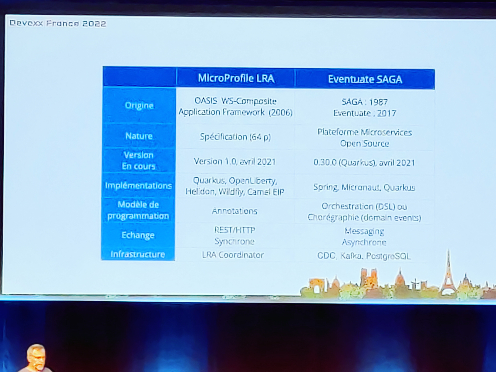

### Microprofile LRA (synchrone)
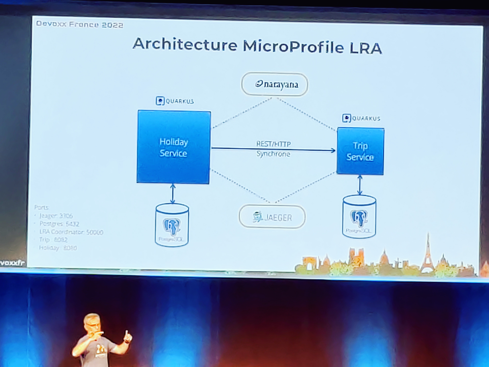
Annotation principales: @LRA, @Compensate, @Complete  
permettant de gérer les transactions distribuées sur plusieurs ms de manière propre  

### Eventuate (asynchrone)
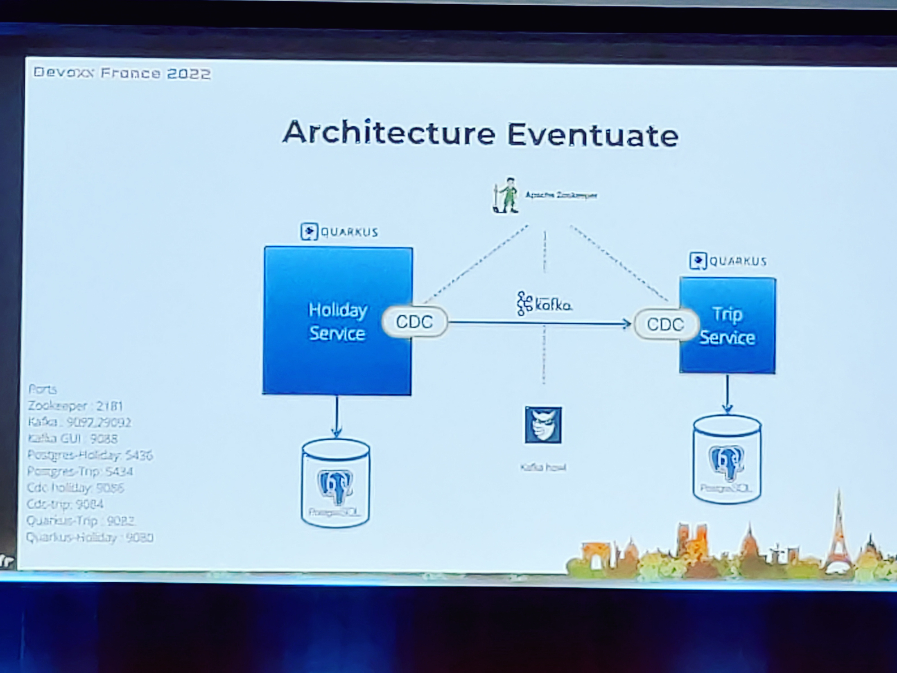
Méchanisme CDC:  
scrute la tale des messages et les gère sur une transaction classique  
c'est lui qui pousse les messages dans Kafka  
(on obtient des messages kafka "transactionnels")  

Outil pour regarder des messages Kafka: kowl  

### Conclusion/takeaway
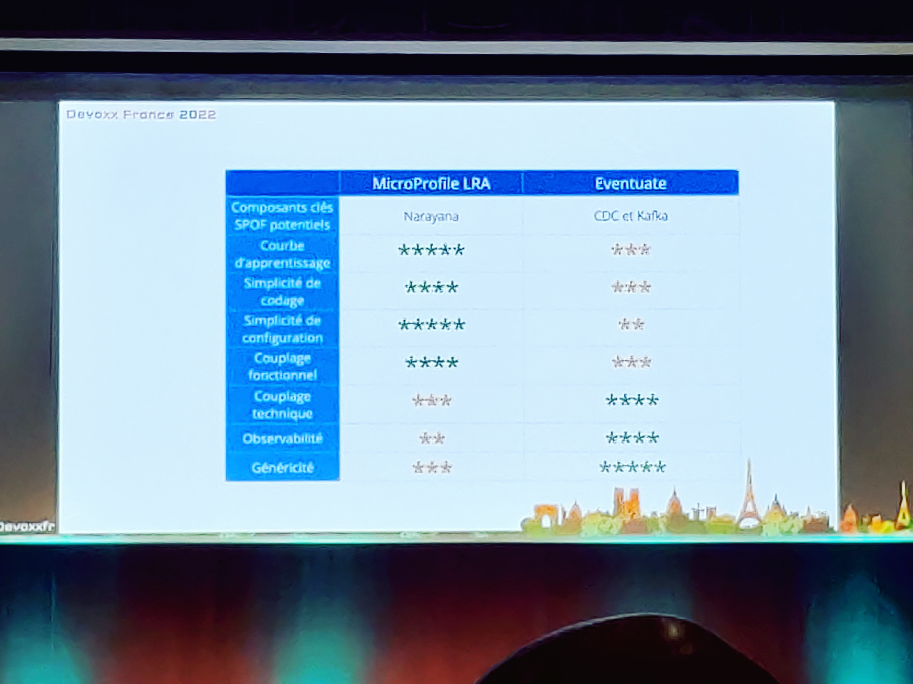
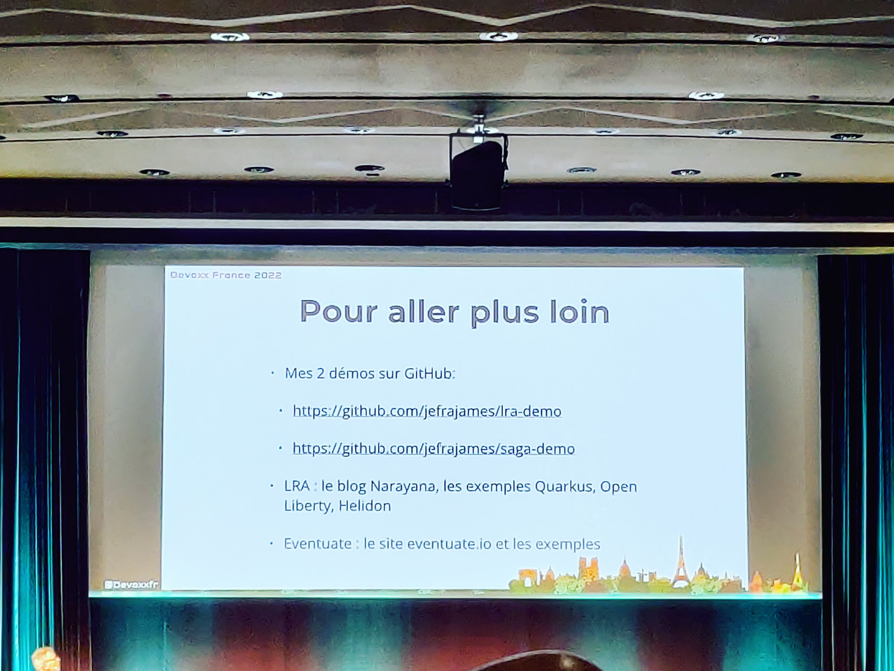
